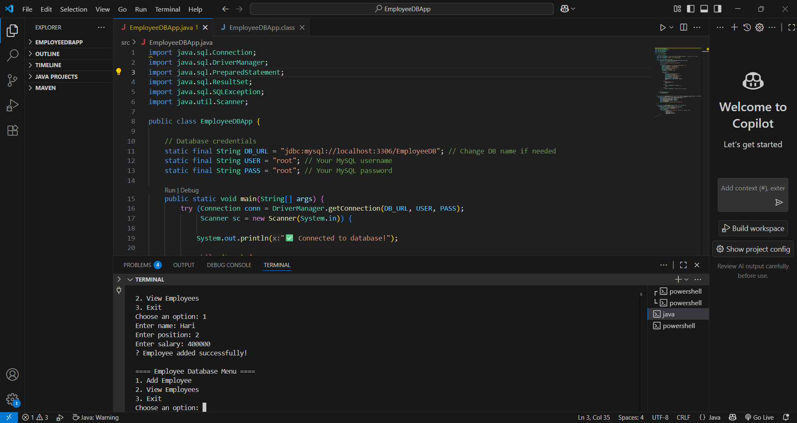

# EmployeeDBApp  

A simple Java application that connects to a MySQL database to manage employee records from the command line.  

## 📸 Screenshot  
  

## 📖 Features  
- Add new employee details to the database  
- View all employees in a tabular format  
- Simple and easy-to-use text-based menu  

## 🛠 Requirements  
- Java JDK installed (version 8 or later)  
- MySQL installed and running  
- MySQL Connector/J `.jar` file (e.g., `mysql-connector-j-9.4.0.jar`)  

## 🚀 How to Run  
1. Clone this repository or download the files.  
2. Place the `mysql-connector-j-9.4.0.jar` in a `lib` folder.  
3. Open a terminal/command prompt in the project folder.  
4. Compile & run in:  
   ```bash
   javac -cp "lib/mysql-connector-j-9.4.0.jar;src" src/EmployeeDBApp.java
   java -cp "lib/mysql-connector-j-9.4.0.jar;src" EmployeeDBApp

✨ Happy Coding! Keep building awesome Java projects! 🚀
